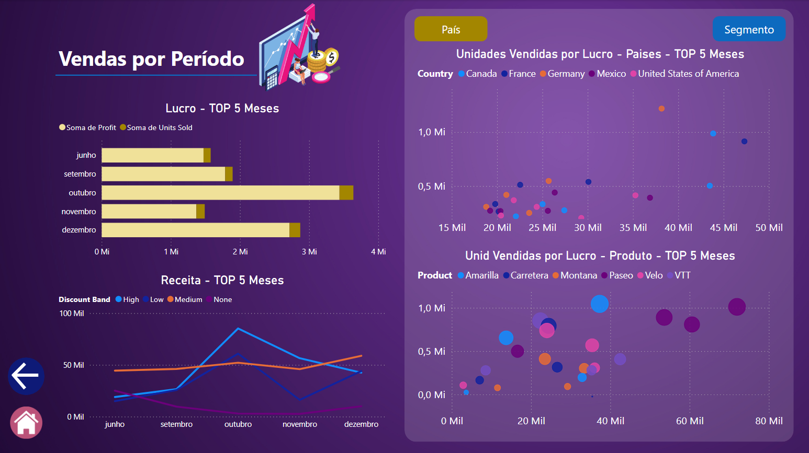

# Relatório de Vendas e Lucros com Data Analytics

## Objetivo

O objetivo deste relatório é apresentar uma análise detalhada das vendas e lucros utilizando a ferramenta Power BI. Por meio de visualizações interativas e informativas, buscamos facilitar a interpretação dos dados, identificando tendências, oportunidades e desafios no desempenho das vendas. O foco é entender quais produtos se destacam, quais regiões apresentam melhor performance e como as vendas se comportam ao longo do tempo. Este relatório visa fornecer insights que ajudem na tomada de decisões estratégicas.

## Desenvolvimento

### Estrutura do Relatório

O relatório foi desenvolvido em 6 páginas, permitindo uma visualização clara e objetiva dos dados. As principais seções e visuais incluídos são:

1. **Página 1: Capa do Relatório**
   - **Home Page**: Página de apresentação do relatório proposto.
  
2. **Página 2: Principal**
   - **KPI's**: KPI's apresentam valores gerais relaciodos a vendas, descontos e outros parâmentros relacionados ao tema.
   - **Gráfico de Área**: O grafico apresenta o volume de vendas de todos os produtos no decorrer de todos os meses.
   - **Grafico Barras e Donut**: O gráfico apresenta a quantia monetária captada por meio das vendas, de modo absoluto (barras) ou relativo (donut).
   - **Grafico Treemap e Map**: Os graficos apresentam o capital desembolsado por cada país para aquisisção dos produtos.

3. **Página 3: Visão Geral de Vendas** 
   - **Vendas**: Gráfico de barras destaca o volume de vendas no decorrer dos meses/semestre, permitindo os meses/semestre que impulsionam as vendas. E também, gráfico de barras destaca o produto que gera o maior volume de vendas.
   - **Histograma**: Histograma destaca qual o intervalo de unidades vendidas proporciona o maior lucro.

4. **Página 4: TOP 3 Produtos**
   - **Principais Produtos em Vendas**: Apresentam os 3 principais produtos vendidos. Também, gráficos de barras apresentam, de maneira absoluta e relativa, o peso no volume de capital gerado pelos 3 principais produtos quando comparados com os demais.
   - **Gráfico de dispersão**: Visualição das unidades vendidas e olucro gerado por cada produto no decorrer dos meses. O gráfico animado permite analisar a evolução das vendas de cada produto no decorrer do tempo. 
   - **Medidas**: Desenvovlimento de medidas para calcular o volume de vendas gerado pelos principais produtos. Também, geramos outra para obter o volume de vendas para os demais produtos.

5. **Página 3: Vendas por Região**
   - **Principais Compradores**: Apresenta o comportamento dos países como cliente, verificando a quantidade de unidades adquiridas e o fluxo de capital desembolsado para aquisição dos itens. Também, podem ver os segmentos com maior relevância no mercado de cada região para compreender a caracteristica destes clientes.

6. **Página 6: Data Analytics**
   - **Gráfico TOP N**: Um ranking com o meses de maiores vendas é gerado por um grafico de barras, apresentando os maiores lucros e as unidadee vendidas para os repectivos meses.
   - **Gráfico de Dispersão**: Gráficos de dispersão mostram a relação entre unidades vendidas e o lucro gerado nos melhores meses de vendas, permitindo analisar a correlação entre a quantidade de produtos vendidos e a receita gerada. Alem disso, eles apresentam os produtos comprados neste periodo e os seues respectivos clientes. Além disso, um grafico apresentam o volume vendido nos melhores meses com o tipo de disconto ofertado para compra dos produtos.

### Considerações de Design

A disposição dos visuais foi cuidadosamente planejada para garantir uma navegação intuitiva e uma experiência de usuário fluida. Os gráficos foram organizados de forma que as informações mais relevantes estejam em destaque, facilitando a interpretação dos dados. Cores e formatos foram selecionados para maximizar a clareza, e as legendas foram incluídas sempre que necessário para contextualizar as informações.

## Conclusão

O [relatório](SalesReport_DesafioDio.pbix) de vendas e lucros gerado com Power BI oferece uma visão abrangente e acessível do desempenho comercial da empresa. As visualizações não apenas destacam os principais produtos e mercados, mas também facilitam a identificação de tendências e padrões que podem orientar decisões estratégicas. A implementação de medidas personalizadas enriquece a análise, proporcionando dados adicionais que podem ser explorados em projetos futuros. Em suma, este [relatório](SalesReport_DesafioDio.pbix) serve como uma ferramenta valiosa para impulsionar o crescimento e a eficiência da operação comercial.